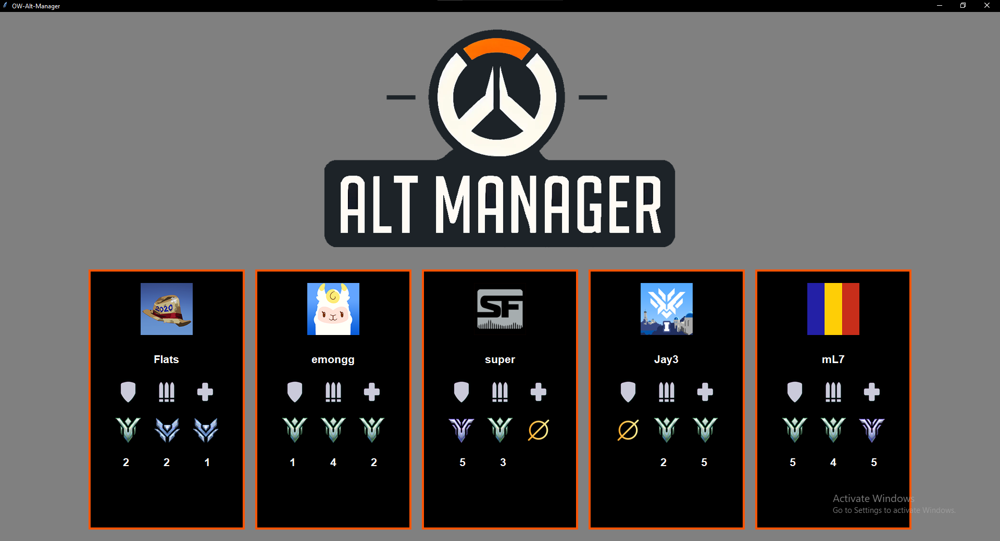

# Overwatch Alt Account Manager

## Description

**Overwatch Alt Account Manager** is a tool designed to help players easily manage and switch between multiple Overwatch accounts. The application displays a list of saved accounts along with their current ranks, allowing users to quickly determine which accounts can queue together. When an account is selected, the application will automatically log out of Battle.net, log into the chosen account, and launch Overwatch.

## Features

- View all saved Overwatch accounts along with their current competitive ranks.
- Easily determine which accounts can play together based on rank restrictions.
- **One-click account switching**: logs out of Battle.net, logs into the selected account, and launches Overwatch automatically.
- Streamlined and efficient account management for Overwatch players.

## Installation and Setup

1. Download and extract the application files.  
2. Navigate to the `/dist` folder and run the executable file.  
3. Upon first launch, the application will generate a `logins.json` file containing mock login credentials.  
4. Close the application and open `logins.json` in a text editor.  
5. Modify the file with your actual Overwatch account logins, adding more accounts as needed.
6. Save the file and relaunch the application to see your updated account list.  
7. The `/dist` folder can be moved anywhere you choose and renamed if desired.  
8. For convenience, it is recommended to create a shortcut to the `.exe` file and place it on your desktop or another easy-to-access location.  

## Usage

1. Open **Overwatch Alt Account Manager**.
2. Browse the list of stored accounts and check their ranks.
3. Click on an account to instantly switch to it and launch Overwatch.
4. The application will handle the logout, login, and game launch process automatically.

## Executable Build

Build the project using :
`pyinstaller --onefile  --icon=images/assets/OWAltLogo.ico  src/main.py`

## Security Notice

- The application does **not** share or transmit any account information outside of your local machine.
- **Use at your own risk**; Blizzard's policies regarding account management should be reviewed to avoid potential restrictions.

## Disclaimer

This tool is intended for **personal use only**. We are **not affiliated with Blizzard Entertainment or Battle.net**. Use of this tool is at your own discretion, and we are not responsible for any potential violations of Blizzard's terms of service.

